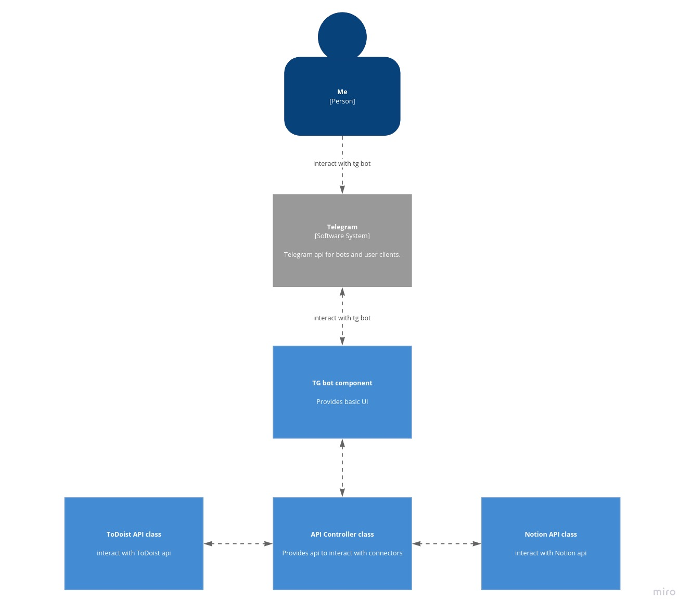

# Simple task tracker

## Why:
[Notion](https://www.notion.so/) is a grate tool to store all task and projects, but it has one problem: no useful widget. In order to solve this problem this project is created.

## Limitations:
Notion is main data source, so all task in [ToDoist](https://todoist.com/) needs to be same. Marking tasks as done in ToDoist didn't to anything)))

## Features:
Other ToDo lists can be easily implemented: 
1. Inherit subclass from BaseAPI and implement all abstract methods
2. Add instance of new class to Controller

It is possible to switch main data source
1. Simply pass instance of required class to Controller initialisation

## Installation:
1. Get all required access tokens.
2. Notin page id can be found in URL e.g. `https://www.notion.so/97e2... 97e2... is page id`
3. Notion database id can be found in url while database is open in full page e.g. `https://www.notion.so/f5af...?v=27a2... f5af... is database id`
4. ToDoist project id can be found in url e.g. `https://todoist.com/app/project/222... 222... is project id`

## Architecture overview
Pattern used: Strategy, Adapter, Singleton

Described in C4 notation
